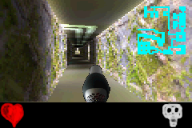
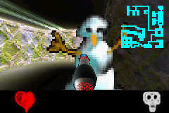
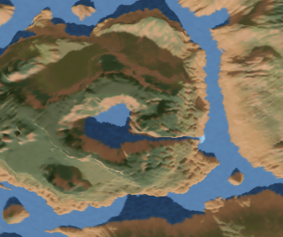

# Peter Supan
## Personal projects

### Jpeg Textures
Repository coming soon.

It began for a low-latency streaming algorithm, where I used it to optimize transfer times by decompressing jpeg(ish) compressed images on the fly on the GPU in a compute shader.

Further experiments aimed at using Jpeg images as textures with the aim to render from a jpeg image without having the whole decompressed image lying around. For huge textures, volume rendering or rendering with limited video memory (like in the browser).

The result is quite fast (130MPixels/sec on a 2019 Laptop GPU) with a poor mans jpeg baseline variant (just Runlength encoding for entropy, no huffman). 

### Vincent in the ice caves
Repository: [https://github.com/petersupan/Raycaster/tree/main/VincentGBA](https://github.com/petersupan/Raycaster/tree/main/VincentGBA])

A rather simplistic 3D Shooter on the Gameboy advance with a completely self-written raycasting engine somewhere between Wolfenstein 3D and Doom.  
I made it out of curiosity if I could pull off a raycasting engine on the 16Mhz ARM3 Chip, without cache, without much graphics hardware support and without Operating System.

It can be downloaded from gamebrew.org:
<https://www.gamebrew.org/wiki/Vincent_In_The_Ice_Caves_GBA>

A youtuber made a video of it:
<https://www.youtube.com/watch?v=niy8JLmbHFs>

### InstantFeedback Running
<https://github.com/petersupan/petersupan.github.io/blob/main/InstantFeedbackRunning.md>

I was frustrated by the fact that there exist so many gadgets for running, which measure parameters related to running technique, but none of them gives immediate, actionable feedback. They all give averaged analytical data to look at after the run, which makes it hard to iterate.

So I decided to explore the possibilites to do this myself.
Goal was to provide feedback on one step in running fast enough so that adaptions could be made in the next step, either visually or acoustic.

### Swedish Box
Repository: <https://github.com/petersupan/svedishbox>

A box which talks swedish words when pressing buttons. Very simple, I made it that my kids hear the swedish language before we moved to sweden. However, they learned a lot more with "Peppa Pig" (or Greta Gris, how it is called in swedish).

### Riding Game
Repository: <https://github.com/petersupan/RidingGame>

A simple jump and run I made for a friend as a birthday present.
All written from scratch in C++ using only SDL1.

### VoxelGPU
Repository: <https://github.com/petersupan/GPUVoxel/tree/main/DesktopOpenGL>

I was always a big fan of the Comanche series games and later Ken Silvermans Voxel engines for terrain rendering (<https://advsys.net/ken/voxlap.htm>). I wanted to prove the claim wrong that these kinds of algorithms (2D-raycasting) are not suitable for GPUs.

I tested ways to parallelize these heightmap rendering engines  to make them run efficiently in compute shaders.

Inspired by Ken Silverland and Peter Houska I made version which renders the voxel landscape in an lat-long style environment map. This makes it possible to make a 6dof engine (instead of the 4dof in Comanche).

Even doing a top-down view.

There exists a OpenGL Compute Shader variant and a WebGPU Compute Shader Variant.

